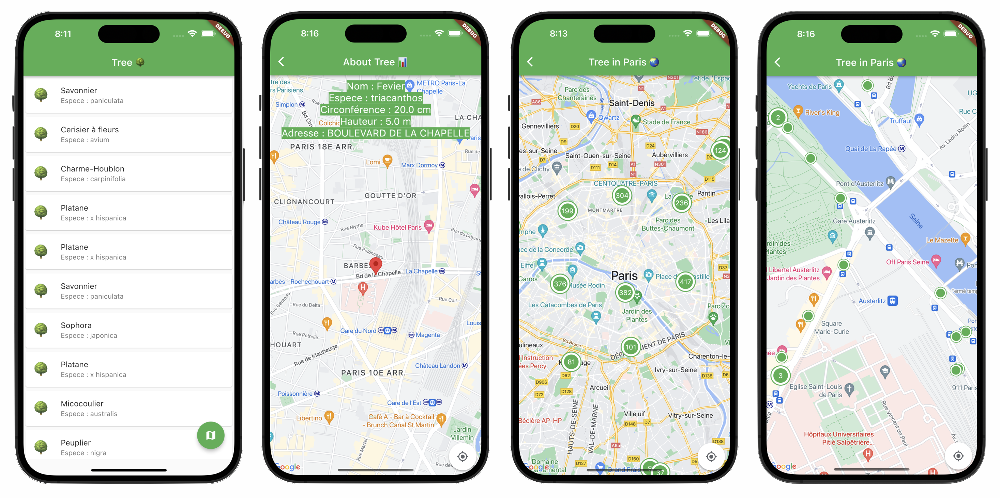

# Arbres de Paris

Ce projet consiste à créer une application mobile qui présente une liste de 20 arbres de Paris. Lorsque l'utilisateur clique sur un élément de la liste, les détails de l'arbre sont affichés, y compris le nom, l'espèce, la hauteur, la circonférence et l'adresse. Les données sont récupérées à partir de l'API OpenData de la ville de Paris.

## Installation

Pour installer ce projet, veuillez suivre les étapes suivantes :

1. Assurez-vous d'avoir installé Flutter en suivant les instructions d'installation sur https://flutter.dev/docs/get-started/install.
2. Ouvrez l'invite de commandes (Windows) ou le terminal (macOS et Linux) et naviguez jusqu'au répertoire où vous souhaitez cloner le projet.
   3.Utilisez la commande `git clone https://github.com/shemtovsamuel/tree.git` pour cloner le projet à partir de GitHub dans le répertoire local.
3. Ouvrez le projet dans votre IDE préféré (Visual Studio Code, Android Studio, etc.).
4. Connectez votre appareil mobile ou lancez un émulateur.
5. Télécharger les dépendances du projet: `flutter packages get`
6. Dans votre IDE, appuyez sur le bouton "run" (ou utilisez la commande `flutter run` dans le terminal) pour exécuter l'application sur votre appareil ou émulateur.

## Conclusion

Ce projet a été une occasion de mettre en pratique mes connaissances en développement mobile avec Flutter. J'ai utilisé des conventions de codage et une architecture solides pour garantir la qualité et la maintenabilité du code. Je suis convaincu que cette application sera utile pour les utilisateurs qui souhaitent découvrir les arbres de Paris.
